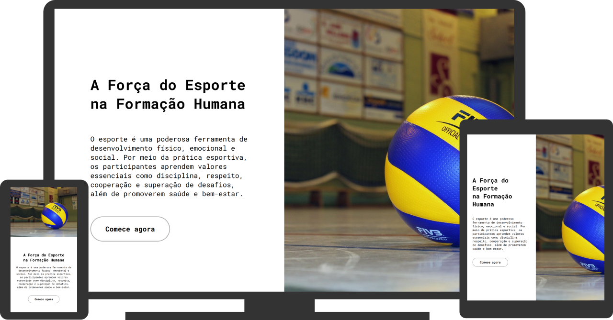

# Esportes Site

### HTML5 + CSS3 e JavaScript

Acesse o projeto: [Esportes Site](https://albuquerque-katarine.github.io/esportes-site)

### Sobre o projeto

Este é um modelo de site desenvolvido com layout moderno e bem estruturado, que utiliza seções em one-column e two-column para melhor organização do conteúdo, garantindo clareza e fluidez na navegação. O design é totalmente responsivo, adaptando-se a diferentes dispositivos e tamanhos de tela, além de contar com um slide de imagens horizontal que valoriza o aspecto visual e torna a experiência do usuário mais dinâmica e intuitiva.

### Finalidade do projeto

A finalidade de desenvolver este modelo de site é demonstrar habilidades em organização de layout, design responsivo e estruturação de conteúdo de forma clara e funcional. O projeto serve como exemplo prático de um site moderno, intuitivo e adaptável, evidenciando conhecimentos em usabilidade, estética visual e experiência do usuário, além de poder ser aplicado ou adaptado a diferentes áreas e necessidades.

### Contato
#### Fale comigo através dos contatos abaixo:

Linkedin: [/katarine-albuquerque](https://www.linkedin.com/in/katarine-albuquerque/) 
E-mail: [kba.2879@gmail.com](mailto:kba.2879@gmail.com)